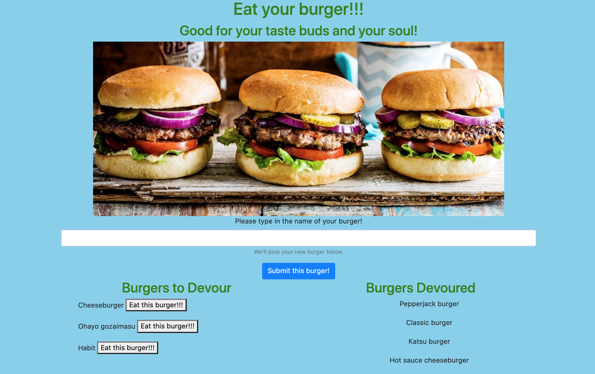

# burger-logger

  

## Table of Contents

* [Link](#link)
* [Description](#description)
* [Installation](#installation)
* [Usage](#usage)
* [Questions](#questions)

## Link

Access the application [here]().

## Description

An application that allows the user to log in the name of a burger and choose to devour each one.

The overall design uses the following:

* `MVC`, a way for organizing code and the main setup of the application
* `mysql` for utilizing methods pertaining to the MySQL database
* `node` for running application

## Installation

To use the application in your environment:

1. Copy `.env.sample` into a file called `.env`.
1. Please include `.env` inside your `.gitignore` file.
1. Inside your `.env` file, change the environment variables to match your environment. Refer back to your database connection parameters if needed.
1. On the Terminal, run `npm install` to install all the required dependencies.
1. Run the command `node server.js` to run the application.

## Usage

When running the app, the user can enter the name of a burger to add onto the "Burgers to Devour" tab below. A button appears next to any burgers listed under this category to "eat" the burger and push it to the "Burgers Devoured" list.

## Questions

For questions or collaborations, please contact me through [GitHub](https://github.com/vxmao87).